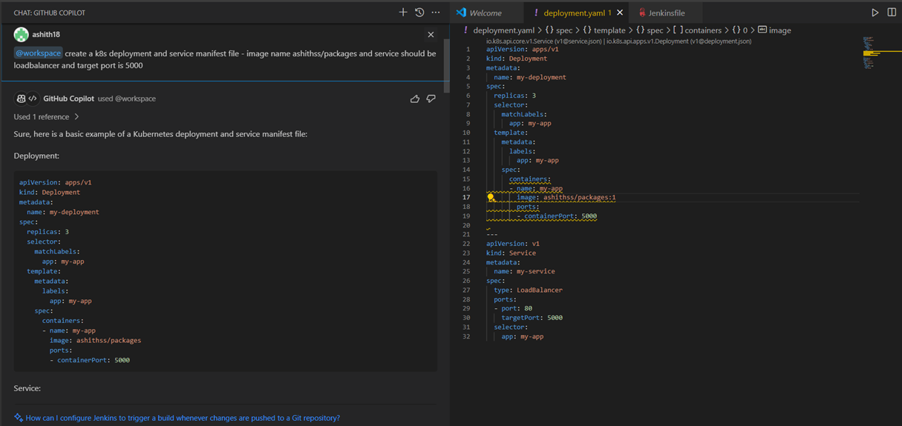
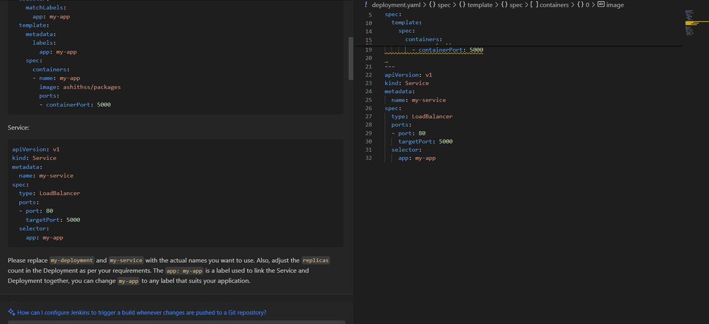
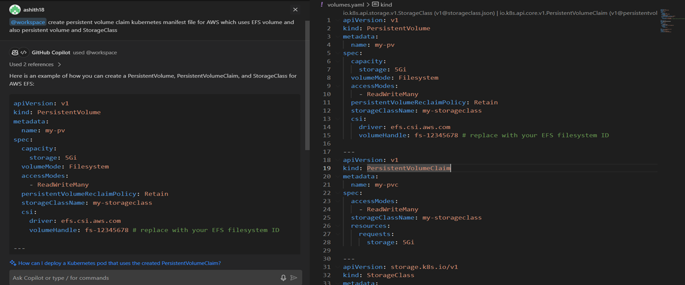
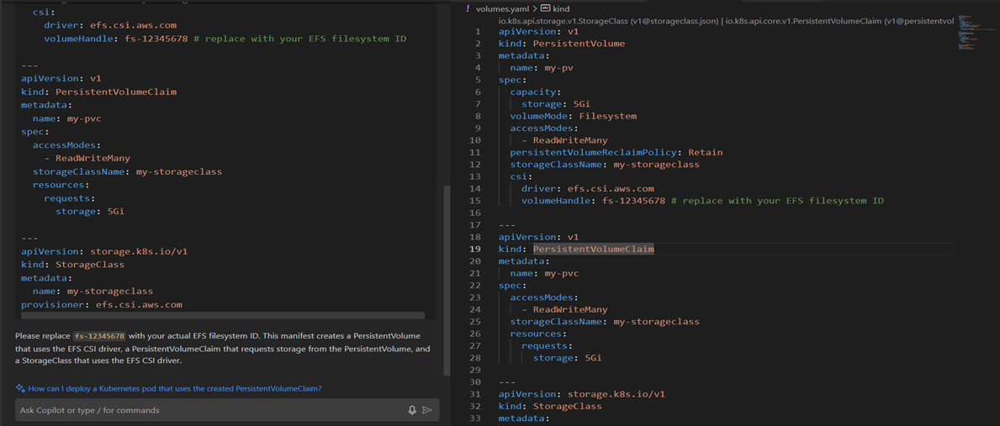
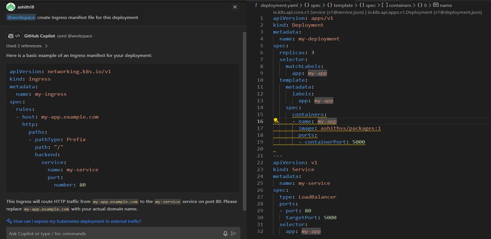

# My Kubernetes Deployment

This repository contains Kubernetes manifest files for deploying a web application or service. The manifest files, including Deployments, Services, Ingress and other resources, were generated using GitHub Copilot, an AI-powered code assistant.

## Overview

- **Kubernetes Manifests**: A set of YAML files defining Kubernetes resources such as Deployments, Services, ConfigMaps, and Secrets for deploying and managing the application or service.
- **Generated with GitHub Copilot**: The Kubernetes manifest files in this repository were generated using GitHub Copilot, leveraging its AI capabilities to assist in the creation of the required YAML configurations.

## Prerequisites

- Kubernetes cluster (e.g., minikube, kind, or a managed Kubernetes service like EKS, AKS, or GKE)
- kubectl (Kubernetes command-line tool)
- GitHub Copilot

## Generating Kubernetes Manifests with GitHub Copilot

The Kubernetes manifest files in this repository were generated using GitHub Copilot, an AI-powered code assistant. Here's how you can use GitHub Copilot to generate similar manifest files:

1. Install the GitHub Copilot extension in your code editor (e.g., Visual Studio Code).
2. Open your project directory in the code editor.
3. Create a new file (e.g., `deployment.yaml` or `service.yaml`).
4. Use GitHub Copilot's suggestions and prompts to generate the desired Kubernetes manifest content for the file.

GitHub Copilot can significantly speed up the development process by providing AI-assisted code generation and suggestions for Kubernetes manifests and other configuration files.

# Screenshots - GitHub Copilot

# Jenkins File - for deployment

# K8s Deployment File

# K8s Service File

# K8s Persistent Volume File

# K8s Persistent Volume Claim and StorageClass 

# K8s Ingress File
